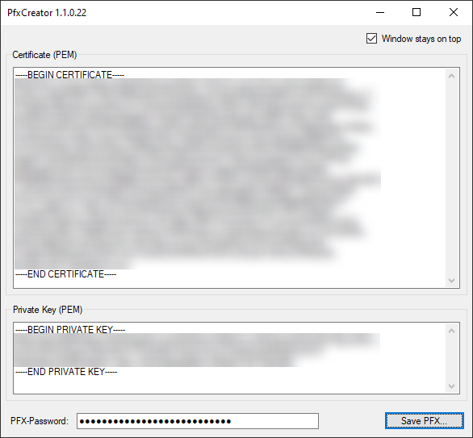

# PfxCreator

> PEM certificate + private key -> PFX

[Download latest release](/georg-jung/PfxCreator/releases/latest/download/PfxCreator.exe)

PfxCreator is a simple, single-exe tool for creating PKCS #12 files (.pfx, .p12) from PEM representations of certificate and private key. No installation or dependency-files needed. PfxCreator works simple and straight forward and might be useful in many cases where you need to import certificates into Microsoft related systems. You don't need to use OpenSsl or any commandline tool. I've created this as a helper to import [Cloudflare](https://cloudflare.com) *Origin Certificates* into an [Azure App Service](https://portal.azure.com/).

* creates pfx or p12 files
* supports RSA and ECDSA keys
* output is encrypted, password can be empty

## System requirements
* .Net Framework 4.6.2
